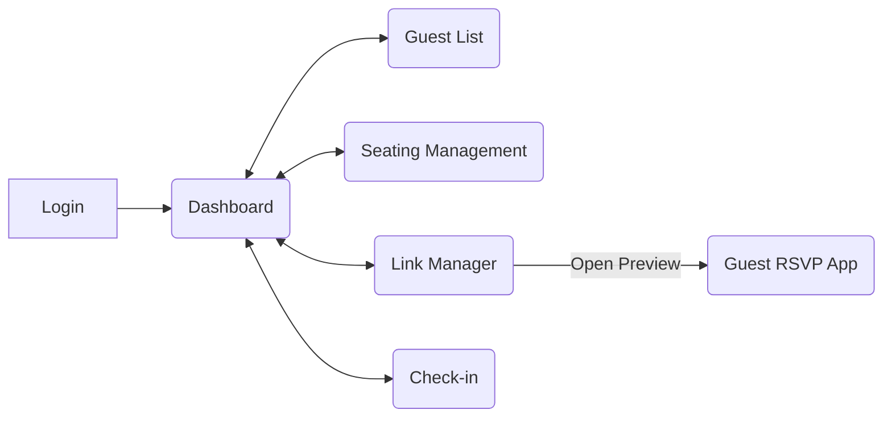
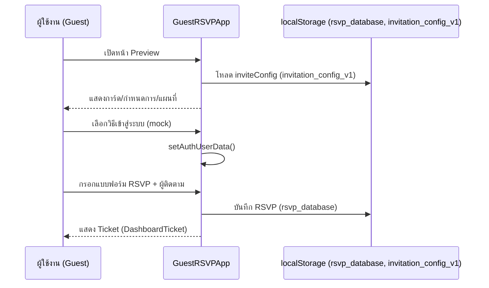
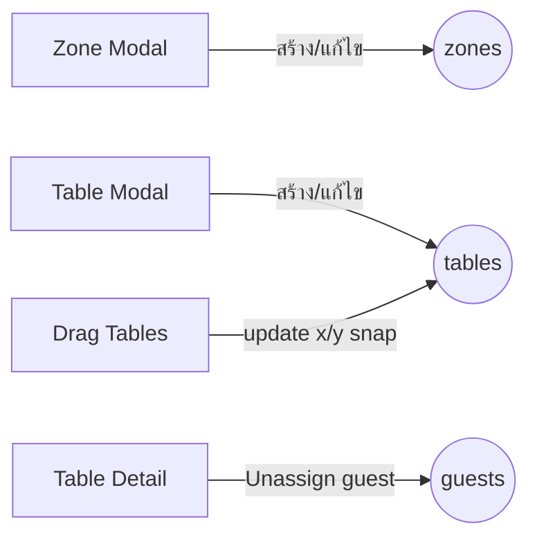
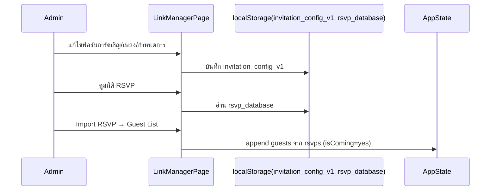

## สรุประบบและแผนภาพ Flow (สำหรับมนุษย์และ AI)

เอกสารฉบับนี้สรุปสถาปัตยกรรม การไหลของข้อมูล (flows) และสคริปต์แบบ Interactive ที่ AI สามารถอ่านและปฏิบัติตามได้ทันที

### Tech & โครงสร้างสูงสุด
- Frontend: React 18 + TypeScript + Vite + Ant Design 5
- State หลัก (admin): อยู่ที่ `src/App.tsx` → `guests`, `zones`, `tables`
- Guest Preview (RSVP): แยกโหมดจาก admin (สลับด้วย `appMode`)
- Persistence (เดโม่): localStorage
  - การ์ดเชิญ/เพลง: `invitation_config_v1`
  - RSVP submissions: `rsvp_database`
- DevSecOps:
  - CI: build + lint + audit (GitHub Actions)
  - CodeQL: สแกนความปลอดภัยโค้ด JS/TS
  - ESLint + security plugin

### บทบาทผู้ใช้
- Admin: จัดการรายชื่อ, ผังโต๊ะ/โซน, เช็คอิน, ตั้งค่าการ์ดเชิญ/RSVP
- Guest: เข้าสู่ระบบ (mock), กรอกแบบฟอร์ม RSVP, รับ ticket สรุป

## แผนภาพสถาปัตยกรรม (Mermaid)

```mermaid
flowchart TD
  A[Admin SPA (React)] -->|state| S((guests/zones/tables))
  A -->|open| P[Guest Preview (RSVP App)]
  P -->|read/write| L1[(localStorage\nrsvp_database)]
  A -->|read/write| L2[(localStorage\ninvitation_config_v1)]
  subgraph Future Backend
    API[(OpenAPI: /api/... )]
    DB[(PostgreSQL)]
  end
  A -. later .-> API
  API --> DB
```

## หน้าหลักและการนำทาง (Admin)

- MainLayout เมนู
  - 1: Dashboard
  - 2: รายชื่อแขก (Guest List)
  - 3: จัดการผังโต๊ะ & โซน (Seating)
  - 4: จัดการลิงค์ & RSVP (Link Manager)
  - 5: เช็คอินหน้างาน (Check-in)



## Guest Preview (RSVP) Flow



## Check-in Flow (หน้างาน)

```mermaid
flowchart TD
  Filter[Filters: side/zone/table + search] --> GroupView[Group List (groupId)]
  Quick[Quick Check-in by name/ID] --> Toggle
  GroupView -->|เช็คอินทั้งกลุ่ม| Toggle[Toggle checkedInAt + method='manual']
  GroupView -->|เช็คอินรายคน| Toggle
  Toggle --> State[(guests state)]
  State --> Stats[สถิติ + Timeline ล่าสุด]
```

## Seating Management Flow (แบบย่อ)

- โซน: สร้าง/แก้ไข/ลบ + สี + ลำดับ
- โต๊ะ: สร้าง/แก้ไข/ลบ + ความจุ + ลำดับ + ตำแหน่ง (drag & snap)
- รายละเอียดโต๊ะ: ดู/ย้ายออกผู้เข้าร่วม



## Link Manager & Preview

- การ์ดเชิญ: banner (url/height/object-fit), title, date, venue, address, schedule (Form.List)
- Google Maps: embed + external link
- เพลง: YouTube URL + ระดับเสียงเริ่มต้น (ปัจจุบันถอด player ออกแล้ว)
- RSVP Status: แสดงจำนวน ตอบรับ/ไม่สะดวก, ปุ่ม Import RSVP → Guest List



## สัญญาเชิงข้อมูล (สำคัญ)

- Guest
  - ฟิลด์เช็คอิน: `checkedInAt: string | null`, `checkInMethod: 'manual' | null`
  - กลุ่ม: `groupId: string | null`, `groupName: string | null`
- InviteConfig (localStorage: invitation_config_v1)
  - `bannerImage`, `bannerHeight`, `bannerObjectFit`
  - `eventTitle`, `eventDate`, `venueName`, `address`
  - `schedule: { time, title, desc? }[]`
  - `youtubeUrl?`, `musicVolume?` (player ถูกถอดแล้ว แต่คีย์ยังคงอยู่ได้เพื่อไม่พังย้อนหลัง)
- RSVP Database (localStorage: rsvp_database)
  - คีย์: `user.id`
  - ค่า: แบบฟอร์ม RSVP + `accompanyingGuests[]`

## แนวปฏิบัติ UX/UI (Ant Design v5)

- แทนที่ `bordered={false}` ด้วย `variant="borderless"`
- Tabs/Timeline ใช้ `items` prop (ไม่ใช้ TabPane)
- แทนที่ `bodyStyle` และ `headStyle` ด้วย `styles.body`, `styles.header`
- แทนที่ `Input.Search enterButton`/`addonAfter` ที่ deprecated ด้วย `Space.Compact + <Button>`
- ใช้ `App.useApp()` สำหรับ `message` (เลี่ยง static function warnings)
- Form.List ห้าม spread props ที่มี `key` ลง JSX โดยตรง (ใส่ `key` แยก)
- Spin `tip` ใช้ในโหมด nested/fullscreen เท่านั้น → ใช้ `<Spin spinning ...><div /></Spin>`

## DevSecOps Snapshot

- CI: build → lint → audit (สูงขึ้นไป) บน Node 20
- CodeQL: วิเคราะห์ `javascript-typescript`
- ESLint: เปิดใช้ `eslint-plugin-security`
- เอกสารประกอบ:
  - `docs/DATA_FLOW.md`, `docs/DATA_MODEL.md`
  - `docs/SECURITY.md`, `docs/THREAT_MODEL.md`, `docs/SECRETS.md`

## Playbooks (Interactive สำหรับ AI)

### A) เพิ่ม/แก้ไขกำหนดการงานแต่ง (Schedule)
1. อ่านค่า config: localStorage key `invitation_config_v1`
2. อัปเดตฟิลด์ `schedule: [{ time, title, desc? }]`
3. เขียนกลับ localStorage พร้อมคงค่าฟิลด์เดิม
4. รีเฟรชหน้า Preview (GuestRSVPApp) เพื่อสะท้อนผล

ตัวอย่าง JSON (merge)
```json
{
  "schedule": [
    { "time": "07:09", "title": "พิธีสงฆ์", "desc": "เจริญพระพุทธมนต์" },
    { "time": "09:09", "title": "พิธีแห่ขันหมาก", "desc": "ตั้งขบวนขันหมาก" },
    { "time": "18:30", "title": "งานฉลองมงคลสมรส", "desc": "เริ่มงานภาคค่ำ" }
  ]
}
```

### B) เช็คอินแขกแบบรวดเร็ว (Quick Check-in)
1. รับอินพุต: ชื่อ/ชื่อเล่น/ID
2. หา guest ที่ยังไม่ได้เช็คอิน (`!checkedInAt`)
3. ตั้งค่า `checkedInAt = new Date().toISOString()` และ `checkInMethod='manual'`
4. อัปเดตสถิติ + ประวัติล่าสุด

### C) Import RSVP → Guest List
1. อ่าน `rsvp_database`
2. คัดเฉพาะ `isComing === 'yes'`
3. map เป็น Guest ใหม่ (เติมฟิลด์จำเป็น, ค่า default)
4. append เข้าสู่ `guests` state

### D) Assign โต๊ะ/ย้ายออกจากโต๊ะ
1. เปิด Table Detail
2. กด “ย้ายออก” → set `tableId=null`, `zoneId` คงเดิม (หรือ null หากต้องการ)
3. บันทึกกลับ `guests` state

## ข้อควรระวัง/กับดัก

- Keys ซ้ำใน Form.List จะทำให้ React warning: จัดการ `key` ให้ไม่ชน (อย่า spread key ลง JSX)
- อย่าใช้ AntD props ที่ deprecated: `bodyStyle`, `headStyle`, `TabPane`, `enterButton`
- โหมด Preview ใช้ localStorage: หากไม่ sync ให้ hard-refresh
- สภาพแวดล้อม OneDrive อาจล็อกไฟล์แคช Vite: กำหนด `cacheDir: '.vite'` ใน `vite.config.ts`

## อัปเดตล่าสุด (Refinements ที่ใช้งานจริงแล้ว)

- Login: เปลี่ยน `message.*` แบบ static → `const { message } = App.useApp()`
- GuestFormDrawer: `bodyStyle` → `styles.body`
- DashboardTicket: `bodyStyle` → `styles.body`
- AuthGateSection: ปรับ Spin ให้เป็น nested เพื่อให้ `tip` ทำงานและไม่เตือน
- RSVPFormSection: ลบ `...field` ที่พา `key` มาถูก spread ลง Form.Item เพื่อแก้ warning
- CheckInPage: เปลี่ยน `Input.Search` (enterButton/addonAfter) เป็น `Space.Compact` + `Input` + `Button`
- ลบ Music Player ออกจาก Guest Preview ตามความต้องการล่าสุด (คีย์ config เดิมยังรองรับเพื่อ backward-compat)

## How to Run (ย่อ)

```bash
npm install
npm run dev   # เปิดที่ http://localhost:5173 (หรือพอร์ตที่กำหนด)
npm run build # ผลลัพธ์ที่ dist/
```

## Glossary
- Zone: กลุ่มพื้นที่ของโต๊ะ
- Table: โต๊ะนั่ง + ความจุ + ตำแหน่งบน canvas
- RSVP: ตอบรับการเข้าร่วมงาน + ผู้ติดตาม
- Check-in: สถานะเข้าร่วม ณ วันงาน

---
เอกสารนี้ออกแบบให้ AI/มนุษย์สามารถ “อ่าน-ทำตาม” ได้รวดเร็ว โดยยึดสัญญาเชิงข้อมูลและแนวปฏิบัติ UI ล่าสุดของระบบปัจจุบัน หากต้องการขยายไป backend ให้ยึด `api/openapi.yaml` เป็นหลักอ้างอิงแรก


